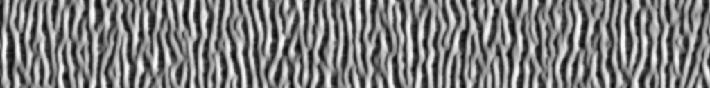

# DuneScape
A minimalist GUI to generate dune fields using cellular automaton.

https://github.com/otto-link/DuneScape/assets/121820229/12f2bf66-c3b0-464a-87e3-97f2db4c424f

# License

This project is licensed under the terms of the MIT license.

# Building

Build by making a build directory (i.e. `build/`), run `cmake` in that dir, and then use `make` to build the desired target.

Example:
``` bash
mkdir build && cd build
cmake ..
make
```
The binary is generated in `build/bin`: 
```
cd build
bin/./dunescape
```

# References
- Elder J., [Models of dune field morphology](https://smallpond.ca/jim/sand/dunefieldMorphology/index.html)
- Werner B.T., Eolian dunes: Computer simulations and attractor interpretation, Geology 1995, 23 (12): 1107–1110, [DOI](https://doi.org/10.1130/0091-7613(1995)023<1107:EDCSAA>2.3.CO;2)

# Dependencies
- Dear ImGui: https://github.com/ocornut/imgui
- stb_image: https://github.com/nothings/stb
- Macro-Logger: https://github.com/dmcrodrigues/macro-logger
